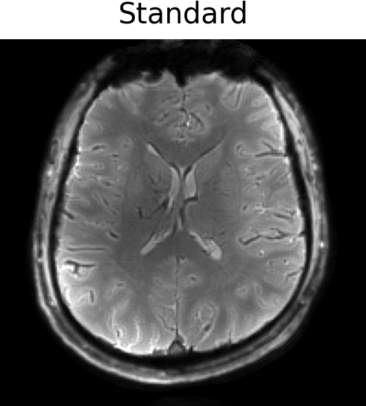
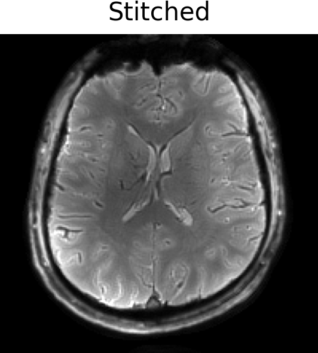
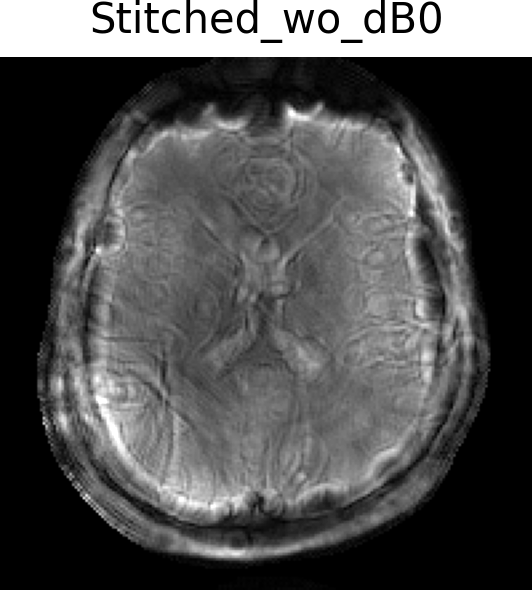

# Data stitching for dynamic field monitoring

 

This is a Julia toolbox for MR simulation and reconstruction that can incorporate dynamic field changes associated with the gradients throughout the sequence. This is an extension of [KomaMRI.jl](https://github.com/JuliaHealth/KomaMRI.jl) (a Julia package for highly efficient MR simulations) and [MRIReco.jl](https://github.com/MagneticResonanceImaging/MRIReco.jl) (a Julia package for MRI reconstruction).

For MRI image reconstruction with field dynamics, we have developed a module `HighOrderMRI.jl` where an extended signal encoding operator `HighOrderOp` is implemented to construct the signal equation. The operator `HighOrderOp` inherits from `AbstractLinearOperator` in [LinearOperators.jl](https://github.com/JuliaSmoothOptimizers/LinearOperators.jl). The image reconstruction problem can be solved using any algorithms from [RegularizedLeastSquares.jl](https://github.com/JuliaImageRecon/RegularizedLeastSquares.jl).

If you use the toolbox, please consider citing the following paper:

Jinyuan Zhang, Zihao Zhang*, Zhentao Zuo, Rong Xue, Yan Zhuo, Cameron Cushing, Alexander Bratch, Edward Auerbach, Andrea Grant, Jing An, Kamil Ugurbil, Xiaoping Wu. "Data stitching for dynamic field monitoring with NMR probes", MRM, submitted.

## Features

* Support up to 2nd or 3rd order spherical harmonic terms.
* Support parrallel imaging and off-resonance correction with extended signal encoding operator `HighOrderOp`.
* Support the model-based synchronization delay estimation algorithm (Dubovan PI, Baron CA. 2023, [https://doi.org/10.1002/mrm.29460](https://doi.org/10.1002/mrm.29460)).
* GPU acceleration with `CUDA.jl` (only NVIDIA GPU has been tested). If the GPU memory is not enough, the calculation can be divided into blocks.

## Demo

This repository provides a set of demo scripts that allow users to perform simulations and reconstructions using both our data stitching method and the standard approach.
You may run the [demo](https://github.com/BennyZhang-Codes/HighOrderMRI.jl/tree/main/demo), to grab an idea of how this toolbox can be used to simulate MRI signals given a pulseq sequence and dynamic field changes measured using a field camera.

### [Recon and Synchronization](https://github.com/BennyZhang-Codes/HighOrderMRI.jl/tree/main/demo/Recon)

For MRI reconstruction incorporating measured field dynamics, we first estimate the synchronization delay between the MRI data and the field measurements. The final reconstruction is then performed using the synchronized field dynamics.

This demo includes single-shot spiral imaging data (7T, 1 mm in-plane resolution, ~29 ms readout), nominal kspace trajectory (Nominal) and field dynamics measured (with Dynamic Field Camera) using both our data stitching method (Stitched) and the conventional single measurement approach (Standard).

In this case, our data stitching method performs comparably to the standard method. For further details on how our data stitching method outperforms conventional approaches, please refer to our abstracts mentioned above.

|  |  |  |  |
| ------------------------------------------- | --------------------------------------------- | --------------------------------------------- | ----------------------------------------------------------- |

### [Sim and Recon for single-channel](https://github.com/BennyZhang-Codes/HighOrderMRI.jl/tree/main/demo/Sim_SingleChannel)

This demo simulates and reconstructs a fully-sampled single-shot spiral sequence (1 mm resolution) [[.seq file]](https://github.com/BennyZhang-Codes/HighOrderMRI.jl/blob/main/demo/Sim_SingleChannel/1mm_R1.seq) with field dynamics and ΔB₀. Reconstruction is based on a extended signal encoding model, which includes the field dynamics (up to second-order) and off-resonance.

### [Sim and Recon for multi-channel](https://github.com/BennyZhang-Codes/HighOrderMRI.jl/tree/main/demo/Sim_MultiChannel)

This demo simulates and reconstructs an under-sampled single-shot spiral sequence (1 mm resolution, R=4) [[.seq file]](https://github.com/BennyZhang-Codes/HighOrderMRI.jl/blob/main/demo/Sim_MultiChannel/7T_1p0_200_r4.seq) with field dynamics and ΔB₀.

### [Multi-echo Gradient Echo (ME-GRE)](https://github.com/BennyZhang-Codes/HighOrderMRI.jl/tree/main/demo/Multi-echo_GRE)

This demo estimates the ΔB₀ map using [MRIFieldmaps.jl](https://github.com/MagneticResonanceImaging/MRIFieldmaps.jl) and the coil sensitivity map using ESPIRiT, based on ME-GRE data in the [ISMRMRD](https://github.com/ismrmrd/ismrmrd) format. Additionally, the ME-GRE sequence can be modified within the [source code](https://github.com/BennyZhang-Codes/HighOrderMRI.jl/tree/main/demo/Multi-echo_GRE/pulseq) ([Pulseq](https://github.com/pulseq/pulseq), MATLAB version).

## Required dependencies:

The current version is mainly based on two other packages: KomaMRI.jl (version: 0.8.0) and MRIReco.jl (version: 0.8.0).

- `Julia` 1.9.4
- `KomaMRI` 0.8.0
- `MRIReco` 0.8.0
- `RegularizedLeastSquares` 0.10.0
- `MRIFieldmaps` 0.0.3
- `PyPlot` 2.11.5

## Copyright & License Notice

This software is copyrighted by the Regents of the University of Minnesota and the Institute of Biophysics, Chinese Academy of Sciences. It can be freely used for educational and research purposes by non-profit institutions, US government agencies, and Chinese government agencies only.
Other organizations are allowed to use this software only for evaluation purposes, and any further uses will require prior approval. The software may not be sold or redistributed without prior approval.
One may make copies of the software for their use provided that the copies are not sold or distributed, and are used under the same terms and conditions.
As unestablished research software, this code is provided on an "as is'' basis without warranty of any kind, either expressed or implied.
The downloading, or executing any part of this software constitutes an implicit agreement to these terms. These terms and conditions are subject to change at any time without prior notice.
