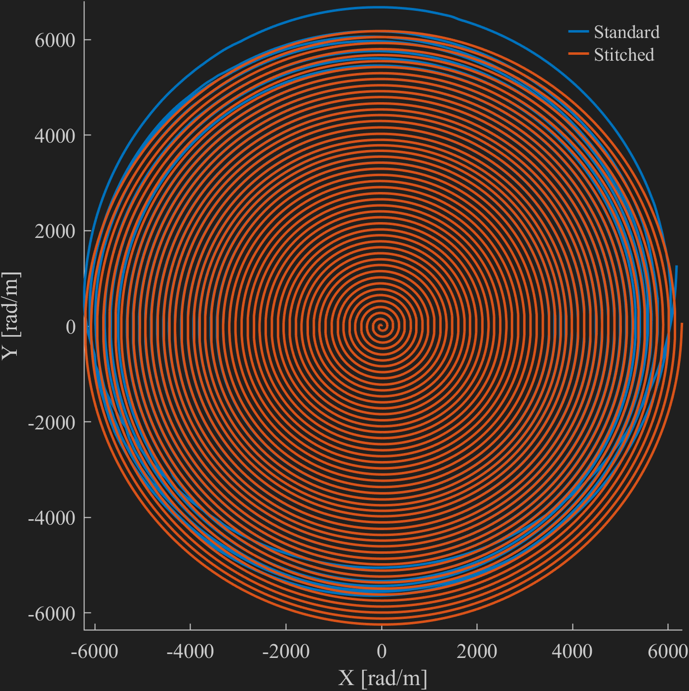
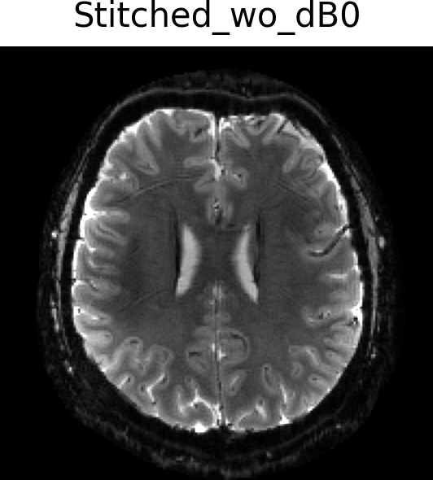

<p align="center">
  <a></a>
</p>

---

[](https://github.com/BennyZhang-Codes/DataStitching/actions/workflows/CI.yml) [](https://github.com/BennyZhang-Codes/DataStitching/actions/workflows/Documentation.yml)

This repository provides code and tools for **data stitching** in dynamic field monitoring using **NMR probes**. It is a **Julia toolbox** for **MR simulation and reconstruction** that can incorporate **dynamic field changes** associated with the gradients throughout the sequence. This is an extension of [KomaMRI.jl](https://github.com/JuliaHealth/KomaMRI.jl) (a Julia package for highly efficient MR simulations) and [MRIReco.jl](https://github.com/MagneticResonanceImaging/MRIReco.jl) (a Julia package for MRI reconstruction).

For MRI image reconstruction with field dynamics, we have developed a module `HighOrderMRI.jl` where an extended signal encoding operator `HighOrderOp` is implemented to construct the signal equation. The operator `HighOrderOp` inherits from `AbstractLinearOperator` in [LinearOperators.jl](https://github.com/JuliaSmoothOptimizers/LinearOperators.jl). The image reconstruction problem can be solved using any algorithms from [RegularizedLeastSquares.jl](https://github.com/JuliaImageRecon/RegularizedLeastSquares.jl).

If you use the toolbox, please consider citing the following paper:

Jinyuan Zhang, Zihao Zhang*, Zhentao Zuo, Rong Xue, Yan Zhuo, Cameron Cushing, Alexander Bratch, Edward Auerbach, Andrea Grant, Jing An, Kamil Ugurbil, Xiaoping Wu. "Data stitching for dynamic field monitoring with NMR probes", MRM, submitted.

<p align="center">
  <a></a>
</p>

## Features

* Supports **up to 2nd or 3rd order** spherical harmonic terms.
* Implements **parallel imaging** and **off-resonance correction** using the extended signal encoding operator `HighOrderOp`.
* Integrates a **model-based synchronization delay estimation algorithm** ([Dubovan PI, Baron CA, 2023](https://doi.org/10.1002/mrm.29460)).
* Enables **GPU acceleration** with `CUDA.jl` (tested on NVIDIA GPUs). If GPU memory is insufficient, computations can be processed in blocks.

## Installation

This package relies on **KomaMRI.jl** (version 0.8.0) and **MRIReco.jl** (version 0.8.0).

```julia
using Pkg
Pkg.add(url="https://github.com/BennyZhang-Codes/DataStitching.git")
```

## Demo

Several demo scripts are available to guide users through **simulations** and **reconstructions** using our **data stitching method** and conventional approaches. See the [demo directory](demo/) for details.

### [Data Stitching](demo/Data-Stitching)

This demo demonstrates our **data stitching method** for dynamic field monitoring using NMR probes. It illustrates how field segments can be stitched together to form a complete time course of the full readout gradient.

For a **~29 ms readout** (1 mm in-plane resolution, R=4), our data stitching method performs comparably to the standard single-measurement approach. However, for a **longer and higher resolution ~88 ms readout** (0.5 mm in-plane resolution, R=4), our stitching method continues to produce reasonable results, whereas the standard method fails.

| **~29 ms, 1 mm, R = 4**                                                 | **~88 ms, 0.5 mm, R = 4**                                                |
| ----------------------------------------------------------------------------- | ------------------------------------------------------------------------------ |
|  |  |

### [Reconstruction &amp; Synchronization](demo/Recon)

For MRI reconstruction incorporating measured field dynamics, we first estimate the synchronization delay between the MRI data and the field measurements. The final reconstruction is then performed using the synchronized field dynamics.

This demo includes 2D single-shot spiral imaging (1 mm resolution with ~29 ms readout, and 0.5 mm resolution with ~88 ms readout) and 2D single-shot EPI imaging (1 mm resolution with ~40 ms readout, and 0.5 mm resolution with ~89 ms readout), all acquired on a 7T Terra scanner. Reconstructions are shown for the nominal k-space trajectory (Nominal), and using measured field dynamics from a Dynamic Field Camera with both our data stitching method (Stitched) and the conventional single measurement approach (Standard).

For more details on how our data stitching method improves over conventional approaches, please refer to the referenced paper.

<table>
  <tr>
    <th colspan="8" style="text-align:center">1 mm in-plane resolution: 2D Spiral (left) & 2D EPI (right)</th>
  </tr>
  <tr>
    <td></td>
    <td></td>
    <td></td>
    <td></td>
    <td></td>
    <td></td>
    <td></td>
    <td></td>
  </tr>
  <tr>
    <th colspan="8" style="text-align:center">0.5 mm in-plane resolution: 2D Spiral (left) & 2D EPI (right)</th>
  </tr>
  <tr>
    <td></td>
    <td></td>
    <td></td>
    <td></td>
    <td></td>
    <td></td>
    <td></td>
    <td></td>
  </tr>
</table>

### [Single-Channel Simulation &amp; Reconstruction](demo/Sim_SingleChannel)

This demo simulates and reconstructs a fully-sampled single-shot spiral sequence (1 mm resolution) [[.seq file]](demo/Sim_SingleChannel/1mm_R1.seq) with field dynamics and ΔB₀. Reconstruction is based on a extended signal encoding model, which includes the field dynamics (up to second-order) and off-resonance.

### [Multi-Channel Simulation &amp; Reconstruction](demo/Sim_MultiChannel)

This demo simulates and reconstructs an under-sampled single-shot spiral sequence (1 mm resolution, R=4) [[.seq file]](demo/Sim_MultiChannel/7T_1p0_200_r4.seq) with field dynamics and ΔB₀.

### [Multi-Echo Gradient Echo (ME-GRE)](demo/Multi-echo_GRE)

This demo estimates the ΔB₀ map using [MRIFieldmaps.jl](https://github.com/MagneticResonanceImaging/MRIFieldmaps.jl) and the coil sensitivity map using ESPIRiT, based on ME-GRE data in the [ISMRMRD](https://github.com/ismrmrd/ismrmrd) format. Additionally, the ME-GRE sequence can be modified within the [source code](demo/Multi-echo_GRE/pulseq) ([Pulseq](https://github.com/pulseq/pulseq), MATLAB version).

## Copyright & License Notice

This software is copyrighted by the Regents of the University of Minnesota and the Institute of Biophysics, Chinese Academy of Sciences. It can be freely used for educational and research purposes by non-profit institutions, US government agencies, and Chinese government agencies only.
Other organizations are allowed to use this software only for evaluation purposes, and any further uses will require prior approval. The software may not be sold or redistributed without prior approval.
One may make copies of the software for their use provided that the copies are not sold or distributed, and are used under the same terms and conditions.
As unestablished research software, this code is provided on an "as is'' basis without warranty of any kind, either expressed or implied.
The downloading, or executing any part of this software constitutes an implicit agreement to these terms. These terms and conditions are subject to change at any time without prior notice.
